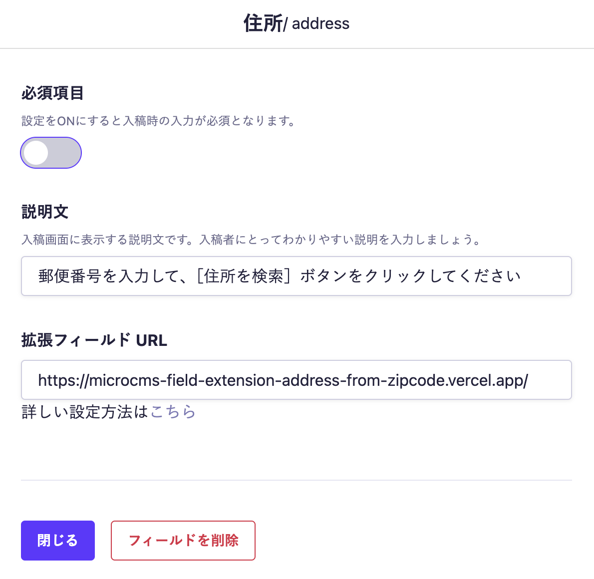

# address-from-zipcode


microCMSの[拡張フィールド](https://document.microcms.io/manual/field-extension)として使用できる、**郵便番号入力で住所を自動補完する拡張フィールド**です。

## 特徴

- 郵便番号を入力するだけで、都道府県・市区町村・町名以下を自動補完
- microCMSの拡張フィールド機能として簡単に導入可能
- OSSとして自由にカスタマイズ・拡張が可能

## インストール方法

```bash
npx create-next-app my-app --example https://github.com/microcmsio/microcms-field-extension/tree/main/examples/address-from-zipcode
cd my-app
export NEXT_PUBLIC_MICROCMS_ORIGIN='https://xxxx.microcms.io'
npm run dev
```
※`'xxxx'`には、ご利用中のサービスIDを設定してください。

## 使用方法
1. microCMS管理画面 → API設定 → APIスキーマ → フィールドの種類：拡張フィールドを追加
2. 「拡張フィールド URL」に、以下いずれかのURLを入力します：
- https://microcms-field-extension-address-from-zipcode.vercel.app/
- 自分でカスタマイズしたものをデプロイしたURL



## レスポンス例
たとえば、郵便番号 `1010045` を指定してコンテンツを保存した場合、以下のようなレスポンスが返ってきます：
```json
{
  "postalCode": "1010045",
  "prefecture": "東京都",
  "city": "千代田区",
  "town": "神田鍛冶町"
}
```
## 利用しているAPIについて

本プロジェクトでは、[株式会社アイビス](https://ibsnet.co.jp/) 様が提供されている「[郵便番号検索API](https://zipcloud.ibsnet.co.jp/doc/api)」を利用しています。  
このAPIを使用することで、郵便番号から都道府県・市区町村・町名以下を取得できます。

### ご利用にあたっての注意事項

- 本拡張フィールドは、[郵便番号検索API 利用規約](https://zipcloud.ibsnet.co.jp/rule/api) に同意のうえでご利用ください。
- 可用性や大量アクセスが求められる場合は、株式会社アイビス様が提供する[郵便番号データ（加工済み）](https://zipcloud.ibsnet.co.jp/)を利用した組み込みをご検討ください。
- 本OSSの利用により発生した不具合や損害について、一切の責任を負いかねます。あらかじめご了承ください。

## Node.js のバージョンについて

本リポジトリでは、Node.js 22 での動作を確認しています。

Node.js では定期的にセキュリティアップデートが提供されています。
安全にご利用いただくため、Node.js を利用する際は
**利用中のメジャーバージョン（例: 22.x）の最新パッチバージョンを使用することを推奨します。**

最新のセキュリティ情報については、以下をご参照ください。
https://nodejs.org/ja/blog/vulnerability/

## ライセンス
このプロジェクトは MIT License のもとで公開されています。
