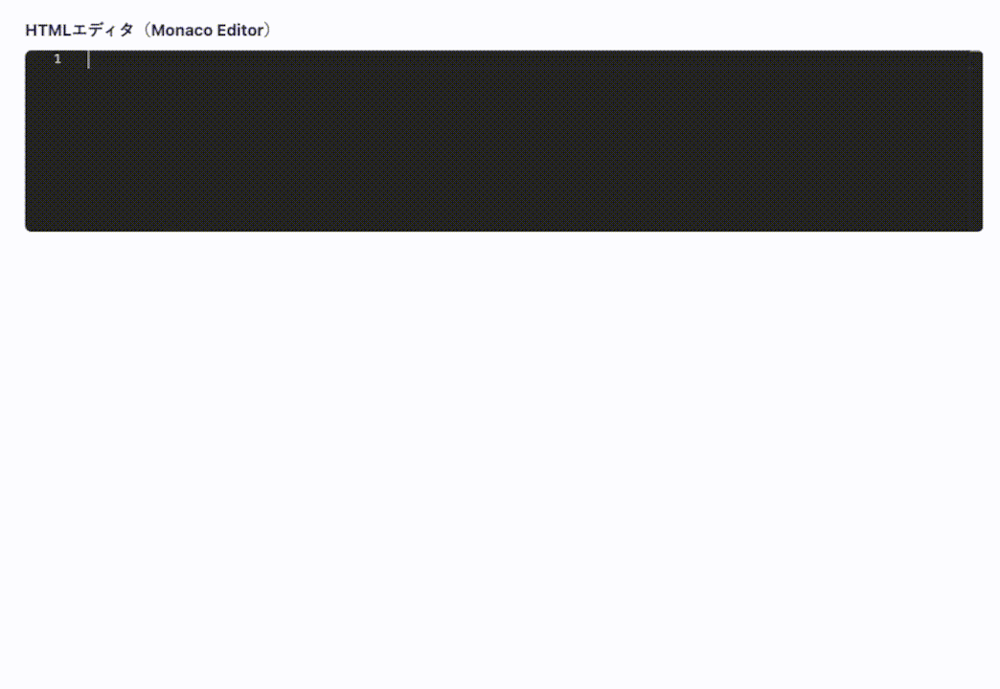

# monaco-html-editor



microCMSの[拡張フィールド](https://document.microcms.io/manual/field-extension)として使用できる、**HTMLエディタフィールド**です。

## 特徴

- 簡易的な補完やインデント、ハイライト機能が付いたHTMLエディタ
- microCMSの拡張フィールド機能として簡単に導入可能
- OSSとして自由にカスタマイズ・拡張が可能

## インストール方法

```bash
npx degit microcmsio/microcms-field-extension/examples/monaco-html-editor#main my-app
cd my-app
export VITE_REACT_APP_MICROCMS_ORIGIN='https://xxxx.microcms.io'
npm install
npm run dev
```

※`'xxxx'`には、ご利用中のサービスIDを設定してください。

## 使用方法

1. microCMS管理画面 → API設定 → APIスキーマ → フィールドの種類：拡張フィールドを追加
2. 「拡張フィールド URL」に、デプロイしたURLを入力


## レスポンス例

例えば、`<p>サンプルテキスト</p>`と入力してコンテンツを保存した場合、以下のようなレスポンスが返ってきます。

```json
{
  "code": "<p>サンプルテキスト</p>"
}
```

## 利用しているライブラリについて

本プロジェクトでは、[Microsoft](https://www.microsoft.com/) 様が提供されている「[Monaco Editor](https://microsoft.github.io/monaco-editor/)」を利用しています。
このライブラリを使用することで、ウェブ上にコードエディタを作成することができます。

### ご利用にあたっての注意事項

本OSSの利用により発生した不具合や損害について、一切の責任を負いかねます。あらかじめご了承ください。

## Node.js のバージョンについて

本リポジトリでは、Node.js 22 での動作を確認しています。

Node.js では定期的にセキュリティアップデートが提供されています。
安全にご利用いただくため、Node.js を利用する際は
**利用中のメジャーバージョン（例: 22.x）の最新パッチバージョンを使用することを推奨します。**

最新のセキュリティ情報については、以下をご参照ください。
https://nodejs.org/ja/blog/vulnerability/

## ライセンス

このプロジェクトは MIT License のもとで公開されています。
